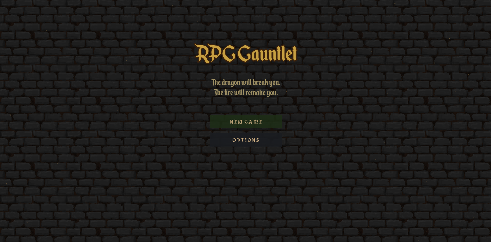
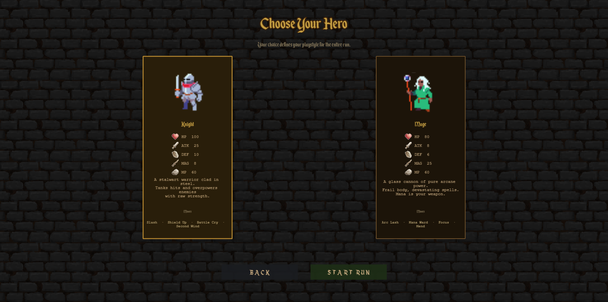
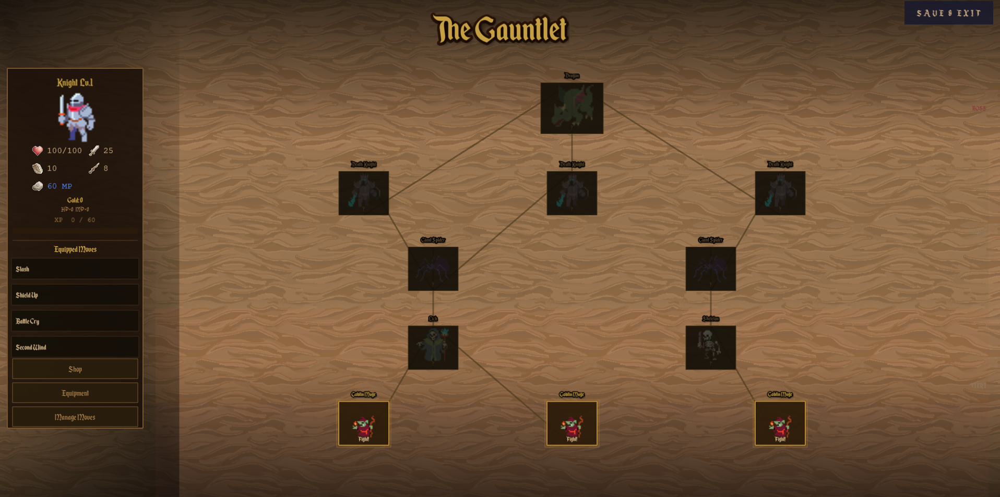
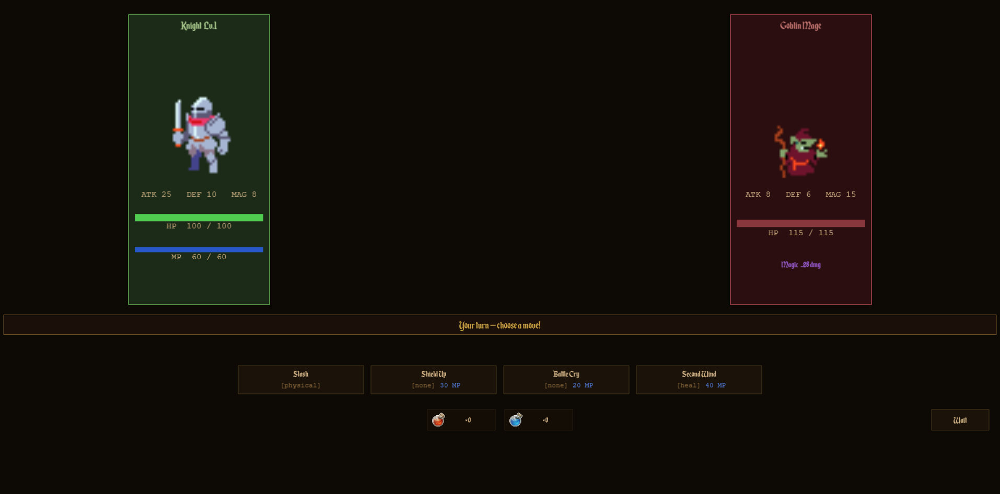
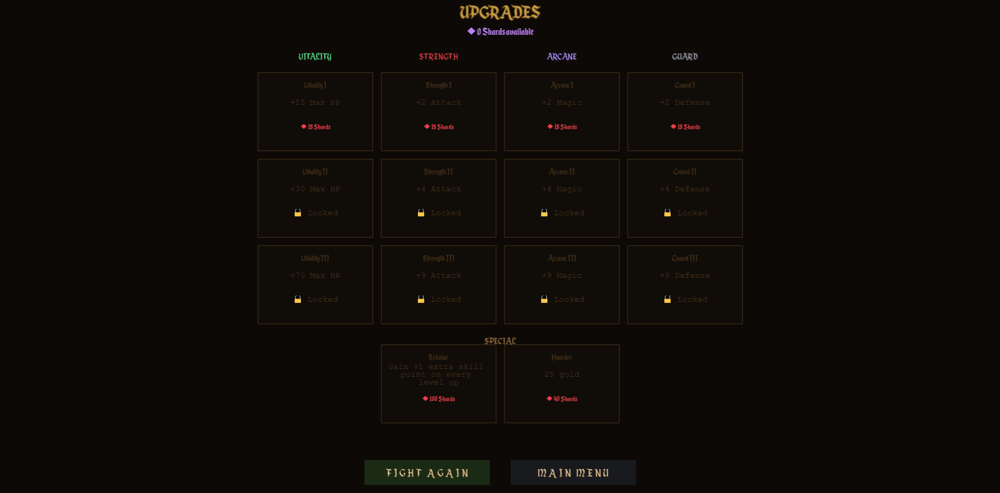

# RPG Gauntlet

<div align="center">


**A turn-based, branching-map RPG built for the Nordeus Job Fair 2026 Full-Stack Engineer challenge**

[Play](https://nemanja5199.github.io/Nordeus-FullStack-2026/) • [Features](#features) • [Tech Stack](#tech-stack) • [Architecture](#architecture) • [Run Locally](#run-locally)

</div>

---

## Screenshots

<div align="center">

|                  Main Menu                  |                  Class Select                  |
| :-----------------------------------------: | :--------------------------------------------: |
|      |   |

|                  Tree Map                  |                  Battle                  |
| :----------------------------------------: | :--------------------------------------: |
|       |         |



</div>

---

## About

**RPG Gauntlet** is a single-player turn-based RPG. Pick a class (Knight or Mage), climb a five-tier branching map of monsters, manage gear and a moveset, and beat the dragon at the top.

Built end-to-end as a Nordeus Job Fair submission: Phaser 3 game client, FastAPI backend with server-side AI, Supabase-backed cloud save, deployed on free-tier infrastructure (GitHub Pages + Render + Supabase).

> **Note:** First load may take ~30 s while the free-tier backend wakes up. Refresh after that and it's instant.

---

## Features

- **Two playable classes** — Knight (tanky, physical) and Mage (glass cannon, magic), each with their own moveset and stat curve
- **Branching map** — five tiers of monsters with multiple paths; map is server-seeded so the layout can't be tampered with
- **Nine unique monsters** with hand-tuned stats and movesets (goblin warrior, goblin mage, skeleton, lich, big slime, giant spider, witch, death knight, dragon)
- **Move-effect system** — physical / magic / heal moves with buffs, debuffs, drains, damage-over-time, mp-burn, and hp-cost effects
- **Equipment system** — five gear slots (weapon, helmet, chestplate, gloves, ring), three rarity tiers, level-gated shop
- **Move learning** — defeat a monster, learn one of its moves; equip up to four
- **Skill points** — earned per level, spent on stat upgrades
- **Meta-progression** — shards persist across runs to buy permanent starting bonuses
- **Cloud save** — sessions sync to Supabase, picks up across devices
- **Server-side AI** — depth-3 minimax search picks each monster's move; evaluation combines HP delta, buff value, and a repeat-penalty
- **Polish** — animated battles (lunge, flash, screen shake on heavy hits), music, SFX, accessibility settings

---

## Tech Stack

| Category         | Technology                                            |
| ---------------- | ----------------------------------------------------- |
| **Frontend**     | TypeScript 5, Phaser 3, Vite                          |
| **Backend**      | Python 3.12, FastAPI, Pydantic                        |
| **Database**     | Postgres (Supabase managed)                           |
| **Testing**      | Vitest (frontend), pytest (backend)                   |
| **Hosting**      | GitHub Pages (frontend), Render (backend)             |
| **CI / CD**      | GitHub Actions (build, test, deploy on push)          |
| **Local Dev**    | Docker Compose (Postgres + PostgREST + nginx)         |

---

## Architecture

```
┌────────────────────────────────────────────────────────────┐
│                          BROWSER                            │
│   Phaser Scenes  ·  GameState  ·  CloudSync  ·  api.ts     │
├────────────────────────────────────────────────────────────┤
│                          FASTAPI                            │
│   /run/meta   ·   /run/start   ·   /battle/monster_move    │
│             /game/save   ·   /game/load                    │
├────────────────────────────────────────────────────────────┤
│                       GAME LOGIC                            │
│   tree_generator  ·  minimax AI  ·  Pydantic-validated     │
│                static config (data/*.py)                    │
├────────────────────────────────────────────────────────────┤
│                         POSTGRES                            │
│         hero_progress  ·  run_saves   (Supabase)            │
└────────────────────────────────────────────────────────────┘
```

A few non-obvious decisions:

- **Stateless backend.** Every request derives its result from the payload; no in-memory game state is shared across requests. Multi-user concurrency is free.
- **Server-authoritative map seed.** `/api/run/start` returns a seeded layout; the client renders it but can't tamper with structure or monster placement.
- **Type-safe data layer.** Static design data validates against Pydantic models at module import — a misshapen move or monster fails the server boot, not a runtime request.
- **Per-scene UI.** Each Phaser scene's UI components live in `frontend/src/ui/<scene>/`; top-level `ui/` holds shared primitives only (Button, ScrollableArea, TooltipManager, HeroPanel).

---

## Run Locally

The local stack (real Postgres, FastAPI backend, Vite dev server) lives on a separate branch to keep `main` focused on what's deployed:

```bash
git checkout local-dev
```

Then follow that branch's `README.md`. Both `dev.sh` (macOS / Linux / WSL) and `dev.bat` (Windows) are provided — one command spins up everything, Ctrl+C / any-key tears it down.

**Prerequisites:** Docker Desktop, Python 3.10+, Node 20+

---

## Tests

| Command                                  | What it runs                       |
| ---------------------------------------- | ---------------------------------- |
| `cd frontend && npx vitest run`          | Frontend unit tests (Vitest, ~210) |
| `cd backend && python3 -m pytest tests/` | Backend tests (pytest, ~190)       |

Both suites run on every push via GitHub Actions.

---

## Project Structure

```
frontend/
├── src/scenes/            One file per scene
├── src/ui/<scene>/        Per-scene UI components
├── src/state/             GameState, MetaProgress, cloud sync
├── src/combat/            Damage / buff math (heavily tested)
├── src/audio/             Music + SFX
├── src/sprites/           Sprite frame maps + class display names
├── src/constants/         Design tokens (colors, layout, fonts)
├── src/services/api.ts    Typed wrapper over the backend
└── src/types/game.ts      Shared shapes (mirrored on the backend)

backend/
├── app/main.py            FastAPI entrypoint, env-driven CORS
├── app/models.py          Pydantic models (request/response + static data)
├── app/routers/           run.py, battle.py, save.py
├── app/data/              Hand-edited config (monsters, moves, items, …)
├── app/tree_generator.py  Branching-map generator
├── tests/                 pytest suite
└── supabase/schema.sql    Postgres schema (used by prod + local-dev)

docs/
└── HOSTING.md             Full deploy plan

.github/workflows/
└── deploy-frontend.yml    Auto-deploy to GitHub Pages on push to main
```

---

## Deployment

For the full deploy plan — GitHub Pages workflow, Render setup, Supabase secrets, end-to-end verification — see [`docs/HOSTING.md`](docs/HOSTING.md).

---

<div align="center">

**Built for the Nordeus Job Fair 2026 Full-Stack Engineer challenge**

</div>
